# MS2: Ash Tree Estates.

[View the live project here.](https://adamdelancey.github.io/ms2-ashtreeestates/)

As my submission for the Code Institute Milestone Project 2, this Ash Tree Estates website is based on a family student letting business
that is looking to expand its audience and get more views and enquiries from the student market, as well as book viewings and have access to useful documents for the tenancy.
It is designed to be responsive and accessible on a range of devices, making it interactive and easy to navigate for potential users.

    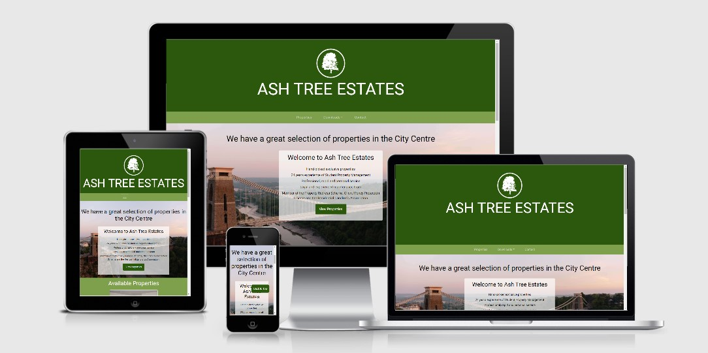

# Access

View the project live: [here](https://adamdelancey.github.io/ms2-ashtreeestates/)

View the Github repo: [here](https://github.com/adamdelancey/ms2-ashtreeestates)

# UX

## Strategy

### Business Objectives

1. To increase the number of direct enquiries through the website.
2. To improve the amount of information on the [current website](https://ashtreeestates.com/), in particular by adding a map feature.
3. To provide up-to-date information on the properties and documentation required.
4. To encourage students to get in touch, book a viewing and ultimately pay a deposit.

### User stories

-   #### First Time Visitor Goals

    As a First Time Visitor, I want to:

    1. Quickly understand the service offered by Ash Tree Estates and have a positive experience while browsing the website.
    2. Easily navigate through the website and find any properties that may interest me.
    3. View all of the properties that Ash Tree Estates have to offer, and the basic details about each one such as the number of bedrooms, bathrooms, area and price.
    4. Be able to filter the properties by the number of bedrooms and area to find the ones that I would be interested in looking at.
    5. Find relative information and pictures regarding each property in order to make an informed decision about whether or not to arrange a viewing.
    6. If interested, book a viewing and know that the request has been processed throughout the site.
    7. Easily find the relevant contact information to get in touch with Ash Tree Estates.
    8. Get the impression that is a professional, reliable and efficient company.

-   #### Frequent User Goals

    As a Frequent User, I want to:
    1. Continue to explore properties and check which ones are available.
    2. Download the documents needed to complete my tenancy agreement and pay my deposit.
    3. Check to see if any properties have been recently added to the site.

## Scope

### Current features

* Navbar 
    * As well as a large title header showing the logo and name, the navbar allows easy access to other areas on the website.
    Based on the UX best practice of having the most important features appear at the top-left, the first option is
    the properties, then the downloadable forms, then access to the contact page, which acts as a call to action. This is 
    featured on all pages.
    * Additionally, the navbar is 'sticky' meaning that it goes down the page as the user scrolls down. This is used across
    all devices and pages.

* 'Back to top' button
    * To improve UX and functionality, there is a 'back to top' button that appears once the user has browsed
    300px down the page. Again, this is used on all devices and pages and allows the user to navigate through the website more quickly.

* Home Page
    * Upon loading the website, the company logo and name start at the centre of the screen with the 
    dark green background to immediately show the branding and leave an impression on the user to remember
    the name and logo. This transitions to its position within 2s leaving the user to explore at their will. 
    * A h1 heading with the areas that Ash Tree Estates offer looping to complete the sentence "we have a 
    great selection of properties in..." this shows a sense of professionalism and fun and quickly shows off
    the areas covered by the company.
    * The 3 properties that appear on the homepage were chosen by the founder of Ash Tree Estates, who currently wants to
    prioritise those properties. However, if the user wants to view more properties, there as an option to click the 'see
    more' button which shows all of the properties, then a 'see less' button to minimise this to the initial 3.
    * There is a contact form at the bottom with a 'submit' button which has a modal thanking the user for his/her
    enquiry. This again acts as a call to action for the user.

* Property Landing Page 
    * Upon loading the page, the user is immediately presented with the option to view all of the properties either
    as a list or on a map (loaded from the Google API). This allows the user to browse based upon their preference of what 
    is important to them when choosing a property.
    * Additionally, there is an option to narrow the search by number of bedrooms. It is assumed that users accessing 
    the website will already know their group size, and so there is a quick way to filter the information that is 
    not relevant to them.
    * Each property shows its location, number of bedrooms and bathrooms, price, and the key selling points to give 
    the user a quick overview of the benefits of that property, and if interested, they have the option of clicking
    either the title or picture to find out more and view the relevant property listing page.

* Property Listing Page (x11)
    * In addition to the key selling points and price/property summary, the user is presented with a button to 
    arrange a viewing, which similarly they can fill in and a modal will appear thanking them for their interest 
    and saying that the company will get back to them. 
    * A carousel of images/videos showing off the properties. Some are fairly poor quality, but this is out of my control 
    as all videos/images have been supplied to me by the company.
    * An 'Explore the Area' section, which using Google API's nearby search allows the user to explore local points 
    of interest including the restaurants, cafes, pubs and supermarkets. These factors can play a large role in 
    selecting whether or not a property is suitable, and therefore could potentially speed up the process from viewing a property 
    online to paying their deposit, particularly for international students who may not be able to view the property in person.

* Contact Page 
    * As above, here we list the various ways to contact Ash Tree Estates, including a 'submit enquiry' button.
    * In addition, professional photos of Bristol have been added to show off the city, as well as some important 
    information about Ash Tree Estates including some key selling points.

### Long-term goals

Future improvements to the website may include:

* More options to narrow down searches, such as a search box, and additional features like being able to browse by price.
* Improved imagery of the properties throughout the site.
* A payment system such as Stripe to take direct bookings and not just enquiries.

## Structure

* I made the decision to have the site split into four clear sections - Home, Properties, Downloads & About, 
with each page having the same navbar and footer details for consistency and ease of use.

* The Home page is one HTML page and is ordered structurally via importance of content, starting with a large
hero image with a 'view properties' button, a few highlighted properties with the option to see more, followed by 
a contact form. 

* The Properties page, the most important page of the site, acts as a landing site for which the user can then 
narrow down their searches and easily find a property that is appealing to them, with the option to then 
move onto the individual property listing. 

* The property listing pages, of which there are currently 11 to represent all of the company's properties, were 
purposely chosen to be on separate pages so that the user can find all of the information and photos relevant to that 
particular property in one place.

* The Downloads section was chosen to be simply down a dropdown list from the navbar for ease of access, where the formns 
will download instantly in a separate tab, meaning that the user stays on the site while they receive the relevant 
document.

* The Contact page, likewise with the Home Page, is one HTML page ordered structurally via importance of content. 
In contrast to the wireframes, it was chosen for the information on what would have been the 'About' Page to be 
combined with the contact page.

## Skeleton

### Wireframes

Desktop View

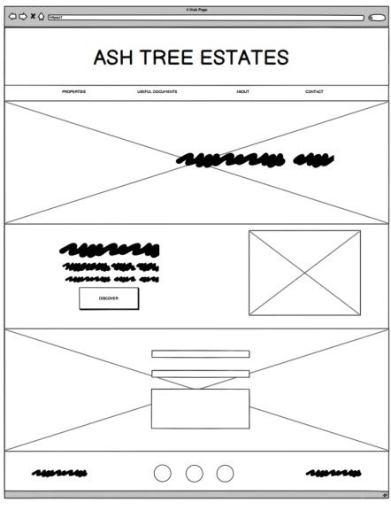
    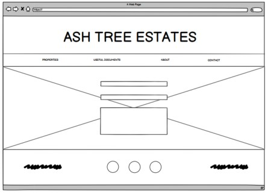    
    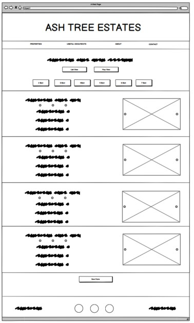
    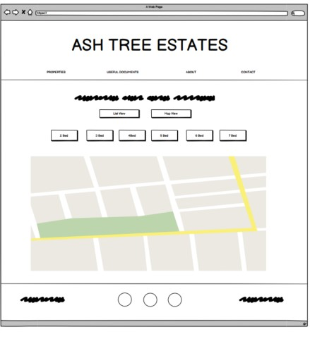
    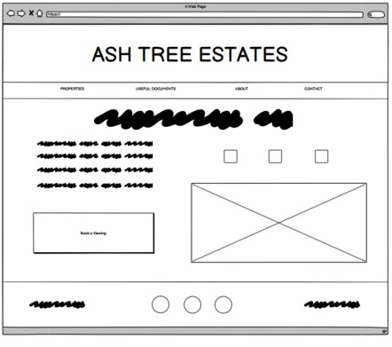

Mobile & Tablet Pages

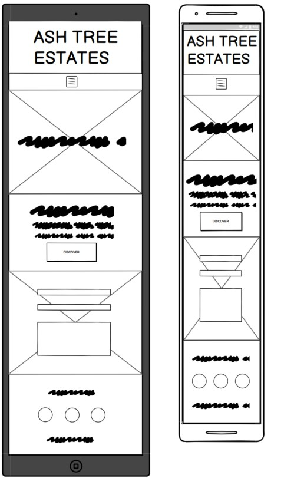
    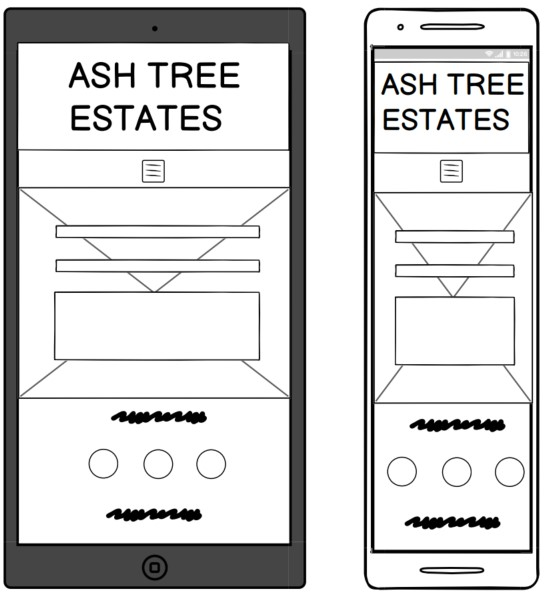    
    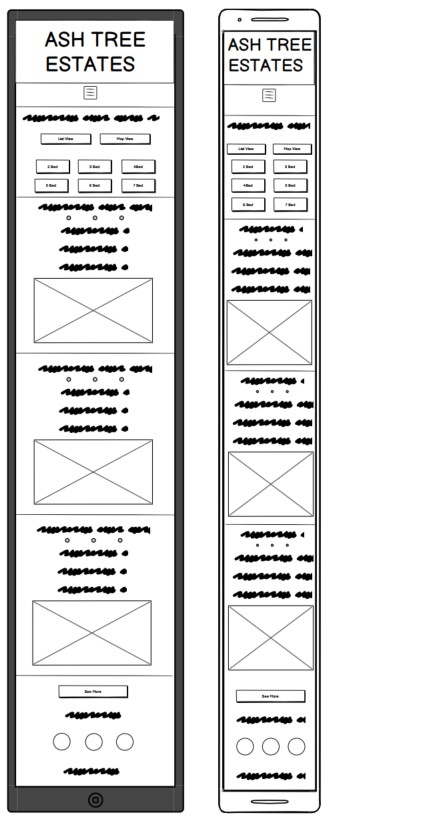
    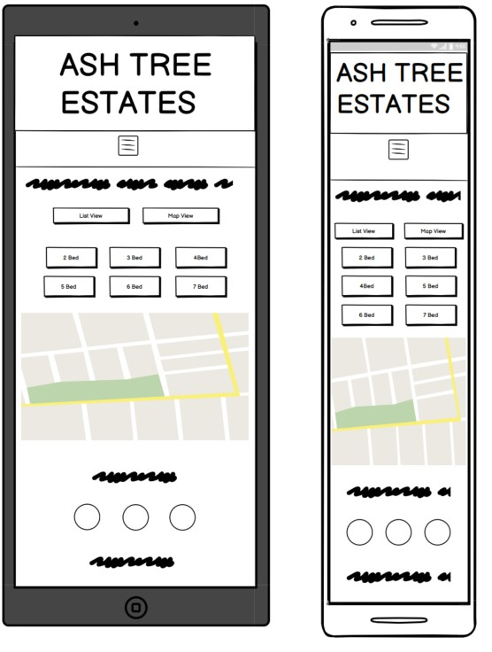
    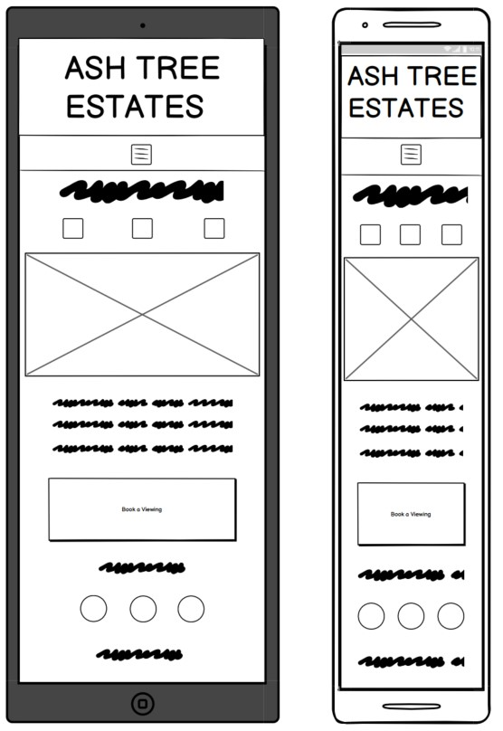

Full wireframes can be accessed here:

-   Desktop Wireframes - [View](documentation/wireframes/desktop-wireframes.pdf)

-   Mobile & Tablet Wireframes - [View](documentation/wireframes/tablet-and-mobile-wireframes.pdf)    

## Surface
   
### Design
-   #### Colour Scheme
    
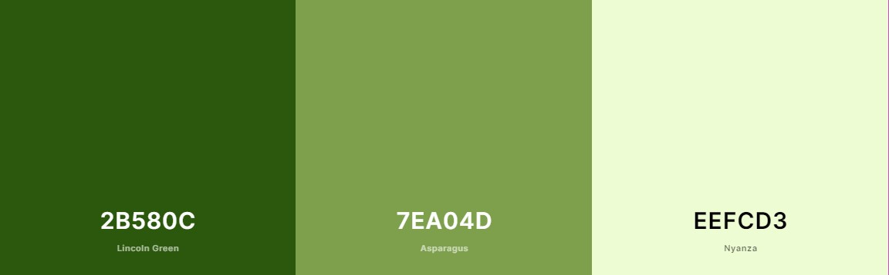
    

    -   The three main colours used are different shades of green, with the darkest green, #2b580c; used for the header, footer and buttons,
    a lighter green, #7ea04d, chosen as a secondary colour to be used for the navbar and other titles, and finally the lightest green,
    #eefcd3, which is used a background colour for any longer text elements or areas that include white. These were chosen from 
    [Color Hunt](https://colorhunt.co/) after agreement with the founder of Ash Tree Estates, as a representation of the color of an ash tree, 
    with the lighter green colours complimenting the header and therefore appealing to the eye.   

-   #### Typography
    -   The Roboto font is the main font used throughout the whole website with Sans Serif as the fallback font in case for any reason the 
    font isn't being imported into the site correctly. Roboto was chosen after agreemeent with the Ash Tree Estates founder.

-   #### Imagery
    -   The Home and Contact Pages will have a large hero image showcasing the city of Bristol, where the properties are located. These 
    professional photos were chosen to give a sense of professionalism to the user and therefore a positive experience.
    - Within each property listing the use can find the photos and videos that were supplied by Ash Tree Estates. The best images of 
    the properties were chosen in order to help sell the user and encourage them to book a viewing to find out more.     
    - All photos were put through [Tiny PNG](https://tinypng.com/) to reduce the file size and improve loading time.

-   #### Icons
    -   Contact icons used in the footer and contact page, as well as in the description for each property have been taken 
     from [Font Awesome](https://fontawesome.com/)

# Accessibility

## Alt Tags

In order to ensure that all images are accessible for those using a screen reader, I have ensured that all images used throughout the site include alt tags.

## Forms

The forms on the site used in the modals of "Contact Us" and "Enquire Now" have aria-labels so that screen readers can read out what is the required input in the necessary fields.

# Technologies used

## Languages Used

-   HTML5
-   CSS3
-   JavaScript

## Frameworks, Libraries & Programs Used

1. [Bootstrap 4.5.2:](https://getbootstrap.com/docs/4.4/getting-started/introduction/)
    - Bootstrap was used to assist with the responsiveness and styling of the website, such as the navbar, carousels and cards features.
1. [Google Fonts:](https://fonts.google.com/)
    - Google fonts were used to import the 'Raleway' font which is used on all pages throughout the project.
1. [Font Awesome:](https://fontawesome.com/)
    - Font Awesome was used on all pages throughout the website to add icons for aesthetic and UX purposes. 
1. [Git](https://git-scm.com/)
    - Git was used for version control by utilising the Gitpod terminal to commit to Git and Push to GitHub.
1. [GitHub:](https://github.com/)
    - GitHub is used to store the projects code after being pushed from Git.
1. [Balsamiq:](https://balsamiq.com/)
    - Balsamiq was used to create the wireframes during the design process.

# Testing

## Validation

The W3C Markup Validator and W3C CSS Validator Services were used to validate every page of the project to ensure there were no syntax errors in the project.

-   [W3C Markup Validator](https://validator.w3.org/) - [Results](https://validator.w3.org/nu/?doc=https%3A%2F%2Fadamdelancey.github.io%2Fms1-travelsweden%2F)
    
   
 
-   [W3C CSS Validator](https://jigsaw.w3.org/css-validator/) - [Results](https://jigsaw.w3.org/css-validator/validator?uri=https%3A%2F%2Fadamdelancey.github.io%2Fms1-travelsweden%2F&profile=css3svg&usermedium=all&warning=1&vextwarning=&lang=en) -  there are 2 property issues found when checking the site. However, these are being validated from the Bootstrap CDN link and therefore out of my control.
    
   
 

## Lighthouse

From Chrome Developer Tools, this Lighthouse score is based on the homepage while being viewed on desktop. I worked hard on ensuring high scores across the site in particular by putting every image through [Tiny PNG](https://tinypng.com/), and improving SEO scores by adding a meta description to each page.

## Testing User Stories from User Experience (UX) Section

-   #### First Time Visitor Goals

    1. As a First Time Visitor, I want to XXXXXXXXXX
        - *XXXXXXXXXX*
    2. As a First Time Visitor, I want to XXXXXXXXXX
        - *XXXXXXXXXX*
    3. As a First Time Visitor, I want to XXXXXXXXXX
        - *XXXXXXXXXX*
    4. As a First Time Visitor, I want to XXXXXXXXXX
        - *XXXXXXXXXX*
    5. As a First Time Visitor, I want to XXXXXXXXXX
        - *XXXXXXXXXX*

-   #### Frequent User Goals
    1. As a Frequent User, XXXXXXXXXX
        - *XXXXXXXXXX*
    2. As a Frequent User, XXXXXXXXXX
        - *XXXXXXXXXX*

## Fixed Bugs
After deployment, I found multiple bugs that needed addressing:

| Bug         | Fix         |
| ----------- | ----------- |
| XXXXXXXXXX | XXXXXXXXXX  |

## Known Outstanding Bugs

| Bug         | Fix         |
| ----------- | ----------- |
| XXXXXXXXXX | XXXXXXXXXX  |

 
## Further Testing

- XXXXXXXXXX
- XXXXXXXXXX
- XXXXXXXXXX

# Deployment

The site was published in GitPages using the folling steps:
1. First, all code was written on the IDE Gitpod and was then pushed to GitHub using the 'git push' entry in the terminal, where it is now stored in [my repository](https://github.com/adamdelancey/ms1-travelsweden).
2. To push the site live, under the Settings section of the repository I selected, I scrolled down to where it says 'GitHub Pages'.
3. I then selected 'Master Branch' under Source and then the page automatically refreshed.
4. This created the URL which can be viewed [here](https://adamdelancey.github.io/ms1-travelsweden/index.html).

To access the code, it can be run locally through a download or cloned.

Initially, I used "git commit" and "git push" for every major change, then at later stages used these functions when de-bugging or making minor editing changes to ensure the live version was the most recent version, as well as to avoid losing any work.

# Credits

- All images have been sourced from a combination of [Pexels](https://www.pexels.com/) and [Pixabay](https://pixabay.com/), except the background photo of the Gothenburg page hero section, which is my own photo.
- The Navbar, Forms, Carousels, Cards and Weather charts on the Tour Pages have been chosen from Bootstrap templates and adapted using CSS.
- The Timeline on the About Page and  has been taken from the Whiskey Drop CI project and amended using CSS for this project.
- [Stack Overflow](https://stackoverflow.com/) was used for occasional debugging or issues where I could not initially work out the solution myself.
- The maps on the Tour pages is from [Google Maps](https://www.google.com/maps) and then using the embed function.
- The carbon calculator on the About page is from [Carbon Footprint](https://www.carbonfootprint.com/integrate.html) and then I used their integrate features.
- Fonts are from [Google Fonts](https://fonts.google.com/) and icons from [Font Awesome](https://fontawesome.com/).

# Acknowledgements

- My mentor, Aaron Sinnott, for his help throughout the project.
- The peer-code-review and user-centric-frontend channels on Slack and their trusty channel leads for both code and design tips.
- Friends and family for testing the site on their various devices.
- My girlfriend, for supplying endless tea when I got frustrated!